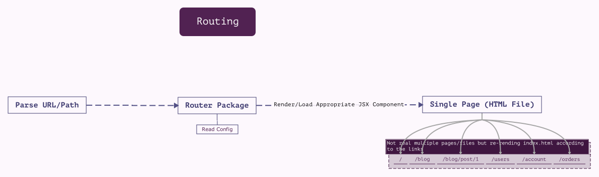

### A descriptive study guide to understanding react routing.
---
| **InitialSetup** |
| --- |
|Pre-configured sample blog application|
|axios package installed|
|using dummy API - https://jsonplaceholder.typicode.com/|



---
#### commit : [Tutorial] Setting up the router package
1. Install react-router and react-router-dom - This is not facebook provided package but it is the defacto package for routing in React.
    >:/react-stud-routing$ npm install --save react-router react-router-dom

2. We can enable routing in App.js or index.js file. We need to wrap the part of your app which should be able to read/render routes with BrowserRouter component from react-router-dom. We did it in App.js and that is router of our application.

3. Converted the existing components to containers (FullPost, NewPost since they are going to act as seperate Page) also created Posts container inside Blog container. Adjusted the imports accordingly.
---
#### commit : [Tutorial] Preparing the project for Routing
4. Separated Posts section to a separate container. Copied state & selected Post Handlers.

5. Removed .Posts class from Blog.css and created new Posts.css

6. Imported Posts to Blog as / component & Displayed it under navigation bar.
---
#### commit : [Tutorial] Setting Up and Rendering Routes
7. Import the named export { Route } from react-router-dom to the router component - in our case it is Blog.js.

8. Declare the self closing Route JSX element wherever you need to route something.

9. Route can pass below props (predefined and must be same as this),

  | Props | Definition |
  | --- | --- |
  | path | URL path which should trigger routing to which component. This controls the display of the page. |
  | exact | (Optional) whether the mentioned path should match exactly. If not mentioned, consider the path starts with mentioned char/word. |
  | render | (Optional) Anonymous arrow function that returns JSX of your choice. Not recommended for loading components. Recommended for short info messages|
  | component | This allows us to pass the component that should render with this route. It needs to be reference to a function or class that we want to use. |
---
#### commit : [Tutorial] Rendering Components for Routes
10. Routed '/' to the component Posts class imported from Posts.js

11. Example of routes

  | Recommended | Not Recommended |
  | --- | --- |
  | `<Route path='/' exact render={() => <h1>Dummy</h1>}/>` | `<Route path='/' exact render={() => <Posts/>}/>` |
  | `<Route path='/' exact component={() => {<Posts/>}}/>` | |
  | `<Route path='/' exact component={Posts}/> ` | |
---
#### commit : [Tutorial] Switching Between Pages
12. Created one more route for new-post and routed it to NewPost class in NewPost.js

13. Issue with current routing is whenever the URL routing happens, the react application refreshes and hence previous state & Props are lost. Need to fix this.
---
#### commit : [Tutorial] Using Links to Switch Pages without reloading
14. We can use Link component from react-router-dom instead of anchor tag <a></a>

| Props | Type | Description |
| --- | --- | --- |
| to | String, Dynamic JS Object | to direct where it should go to when clicking

| Props | Type | Description |
| --- | --- | --- |
| to | String | It can be a simple string like below `<Link to="/">Home</Link>` |
| to | Dynamic JS Object | It can be dynamic JS Object wrapped by {{}} (First {} to wrap JS OBject & Second {} to wrap the dynamic content) as below `<Link to={{pathname: '/', hash: ''#second', search: '?quick-submit = true'}}`>Home</Link>
| pathname | Object. Specific to 'to' Props | To direct the link to route |
| hash | Object. Specific to 'to' Props | To jump to HTML Element with id mentioned to hash |
| search | Object. Specific to 'to' Props | To pass any query parameters |

15. Need to import the named export ***Link*** from react-router-dom package.
---
#### commit : [Tutorial]  The "withRouter" HOC & Route Props
16. The special router specific props are passed only to the direct component loaded through the Route. To get the route information (props) in the nested component loaded inside routed parent component, there are two ways

  > While calling the component, pass the props using spread operetor or pass a prop which match specific prop from router
  ```javascript
  <Post {...props}/>
  <Post {path = this.props.pathname}/>
  ```
  
  > We can use HOC withRouter from react-router-dom and wrap the component that want to learn the route.
  ```javascript
  export default withRouter(post)
  ```

17. This will be helpful to understand the route history (as history is one of the props) and pushing back and forward.
---
#### commit : [Tutorial] Absolute vs Relative Paths
18. Absolute path is the path always attach just to the domain name. Example.,
```javascript
pathname: '/new-post'
```
This will result in just appending the pathname to the domain name --> www.example.com/new-post

19. Relative path is the path that appends to the current available path. Example.,
if you already passed `/new-post` and you are in new-post component then using
  ```javascript
  pathname: this.props.match.url +'/first'
  ```
  > This will result in www.example.com/new-post/first

20. Default is always absolute path.
---
#### commit : [Tutorial] Styling the Active Route
21. To style the link/route which is active, use NavLink named export instead of Link from react-router-dom.
  ```javascript
  import { NavLink } from 'react-router-dom'
  ```

22. Nav link have additional properties of classname & inline styles using which we can style the component.
  ```javascript
  <NavLink to='/'>Home</NavLink>
  ```
  > by default it adds the classname active.

23. to change the default classname, use activeClassName prop and define your own name
  ```javascript
  <NavLink to='/' activeClassName='my-active'>Home<NavLink/>
  ```

24. to use inline style use activeStyle prop which is a dynamic content & JSObject hence within {{}}
  ```javascript
  <NavLink to='/' activeStyle={{color: 'black', textDecoration: 'none', backgroundColor: 'white'}}>Home<NavLink/>
  ```
  > NavLink styles are only active when the link is active.

---
#### commit : [Tutorial] Passing Route Parameters
25. passing a dynamic parameters on the route can be done using ':' in 'to' as,
  ```javascript
  <Link to={'/'+post.id}><Post></Post></Link>
  ```
  => {} at 'to' because it is dynamic

  ```javascript
  <Route to='/:id' component={FullPost}/>
  ```
  With this, we can pass the dynamic parameter content to the FullPost Component in the name of id.
---
#### commit : [Tutorial] Extracting Route Parameters
26. Parameter passed to the Route through Link is then passed to the component. Those dynamic parameters loads within params inside match inside props. We can access them as below,
  ```javascript
  this.props.match.params.id
  ```
---
#### commit : [Tutorial] Parsing Query Parameters & the Fragment
27. Query & Fragments can be passed to the component through Link's 'to' and can be extracted inside the component props inside location.

28. The Query parameter that got passed will return the same information as it is when extracted, example.
  ```javascript
  <Link to={'/?start=5'}>Home</Link>

  or

  <Link to={
    pathname: '/'
    search: '?start=5'
  }>Home</Link>
  ```

  ```javascript
  this.props.location.search
  ```
  > this will give you `?start=5` but we need key value pairs.

  The key value pairs can be achieved through the vanilla javascript function URLSearchParams.

  ```javascript
  componentDidMount() {
    const query = new URLSearchParams(this.props.location.search)
    for (let param in query.entries()){
      console.log(param);
    }
  }
  ```
  > URLSearchParams returns object, which exposes `entries()` method. `entries()` returns a constructor for each in `query` as show above. So this will give ['start', '5']

29. The Fragment can be accessed with hash inside location inside props.
  ```javascript
  <Link to={'/#myid'}>Home</Link>

  or

  <Link to={
    pathname: '/'
    hash: '#myid'
  }>Home</Link>
  ```

  ```javascript
  this.props.location.hash
  ```
  >This will give the hash value, predominantly the ID of the Element.

---
#### commit : [Tutorial] Using Switch to Load a Single Route
30. If there are multiple routes pretending to be matching for the single link, then we can use switch to load only one route that matches first and ignore the subsequent routes.

31. Switch component is the named export inside react-router-dom. We need to import switch and wrap the routes that you want inside switch.
  ```javascript
  import { Switch } from 'react-router-dom';

  <Switch>
    <Route to='/new-post' exact component={NewPost}/>
    <Route to='/:id' exact component={FullPost}/>
  </Switch>
  ```

---
#### commit : [Tutorial] Navigating Programmatically
32. Using ***Link*** is absolutely fine for navigation however, if you want to navigate not immediately after clicking but only after getting the response for the request that we sent with that click? or Link usually generates anchor tag which by default listens clicks so if you want to use the clicked property?

33. We can use push prop inside history inside the prop passed and by given push the path to navigate. Example,
  ```javascript
  clickHandler = ( id ) => {
    this.props.history.push('/' + id);

    or

    this.props.history.push({pathname: '/' + id});
  }
  <Post clicked={this.clickHanler(props.id)}/>
  ```

---
#### commit : [Tutorial] Understanding Nested Routes
34. Routes can be nested inside the component that we are passing through the route in the parent component. Example.,
```javascript
@Blog.js

<Route to='/' component={Posts}/>

@Posts.js

<Route to='/:id' component={FullPost}/>
```

>So that the Posts component and FullPost component will get rendered in the Blog component in single page since '/:id' will have match at "/"

>> The best practice it to always have child URL (like '/posts') for each page instead of root '/' URL.

35. The best practice is to dynamically prefix the current path URL that we receive from the params of the parent route in the nested Route. Example,

```javascript
@Posts.js

<Route to={this.path.match.url + ':id'} component={FullPost}
```

---
#### commit : [Tutorial] Creating Dynamic Nested Routes
36. If we are using the nested route, when initially loading the routed component, the component will get mounted with the data. So if you are trying to navigate to different dynamic nested route (Ex. with different id inside Posts), the component will not get unmount & remount. So the data fetching for the second dynamic click will not work.

37. To make it work, we need to add the data fetching part to componentDidUpdate() method as well so the subsequent dynamic nested routes will work correctly. Remember to ensure checking the loaded post & the post that you are going to loaded are different & then try to fetch, if not you will end up in loop since the state change will trigger the re-render & you will be updating the state with fetched data to maintain it across the page.
---
#### commit : [Tutorial] Redirecting Requests
38. Redirection is something that you want the user to redirect to specific URL if they load root or other URL.

39. react-router-dom has a separate named exported component called ***Redirect*** which can be implemented inside Switch with From URL & to URL parameters. Example,
  ```javascript
  <Switch>
    <Redirect from='/' to='/posts'/>
  </Switch>
  ```

---
#### commit : [Tutorial] Conditional Redirects
40. Redirect can be made conditionally so that we can redirect the page after submitting the query or redirect after number of view per page attains.

41. If we are using Redirect outside of Switch, we can only use to='' and not from. Since it is named export of reac-router-dom component, it can be used conditionally just like other components.

42. Redirection will not keep the submitted page in history and hence you cannot go back to that page using back button in the browser.
---
#### commit : [Tutorial] Using the History Prop to Redirect (Replace)
42. Instead of using Redirect component from react-router-dom, we can use the objects in history props (push or replace) from Route component for redirection. Using this there no need to render for redirection.

  ```javascript
  axios.post('url', data).then (response => {
    this.props.history.push('/posts')
  })
  ```
  > push will keep the previous parent rendered component in history and hence can go back to the previous page using browser back button.

43. Using replace we can implement the same Redirect functionality where we cannot go back to the rendered component which redirects it to different page using the render triggered on the conditional redirection

  ```javascript
  axios.post('url', data).then (response => {
    this.props.history.replace('/posts')
  })
  ```
  > replace will not keep the previous parent rendered component in history and hence cannot go back to the immediate page using browser back buttons.

---
#### commit : [Tutorial] Working with Guards
44. Guards are nothing but checking the specific items conditionally before loading the specific route component and redirecting it to different route if the conditions are not met. Example below checks if auth state is true before loading the route and if false, it defaults to home page.

  ```javascript
  state = {
    auth: false
  }

  {this.state.auth ? <Route to='/new-post' component={NewPost} : null}
  <Route to='/' component={Posts}/>
  ```
---
#### commit : [Tutorial] Handling the 404 Case (Unknown Routes)
45. Unknown routes can be handled with Route component by no mentioning the path parameter. However, while using inside switch, Redirect from='/' and this unknown route will not work together since Redirection from / will also catch all unknown routes and redirect it to specific post. Still we can use the Redirection from / to 404 page but very rare use case scenario since / belongs to root which we most of the time plan to redirect to home page. example

  ```javascript
  <Route component={NotFound}/>
  <Route render={() => <h1 style={{textAlign: 'center'}}>Page not found or Unauthorized</h1>}/>
  ```

---
#### commit : [Tutorial] Loading Routes Lazily
46. ***Lazy loading*** or ***Code Splitting*** is a technique of loading the required component only when it is required in terms of chunks and hence reducing the bundle.js file size which will be helpful for building more complex bigger applications. This technique will work on react-router 4 & when using create react app.

47. The code splitting will work based on the webpack configuration hence webpack needs to be setup accordingly. This is handled well when using create-react-app for new app creation.

48. Whenever we mention some import in the component/container we are informing webpack to include the dependency in its global bundle.js file while compiling. So we can use dynamic imports to inform webpack not to include that specific import related component in the main bundle insteand create separate chunks that will be loaded when needed. Dynamic imports can be executed using the special function called `import()`, whatever comes between () is imported whenever this function is called. Example,

  ```javascript
  import AsyncComponent from './hoc/AsyncComponent';
  const AsyncComponentName = AsyncComponent( () => import ('./ComponentName.js'))
  ...
  ...
  render() { return <Route to='/async-comp' component={AsyncComponentName}}
  ```
  > We need to have a function based HOC which should load the component mentioned in the dynamic import whenever that hoc is called.

  ```javascript
  import React, { Component } from 'react';

  const AsyncComponent = (importComponent) => {   //its function based hoc that takes function as argument, in our case it is dynamic import()
    return class extends Component {              //it returns an anonymous class based function which will maintain the complete component in its state
      state = {
        comp: null
      }
      componentDidMount(){                        //It needs to be loaded only after the parent component did mount.
        importComponent().then(component => {     //Calling the passed dynamic import which will return the component passed on its promise.
          this.setState(comp: component.default)  //Loading that passed dynamic import component into state.
        });
      }
      render() {
        const C = this.state.comp
        return ( C ? <C {...this.props}/> : null);  //If state has component then return that component along with props for render otherwise null.
      }
    }
  }
  ```

  > Explanation mentioned inline above. Please refer the same.
---
#### commit : [Tutorial] Routing and Server Deployment


---
